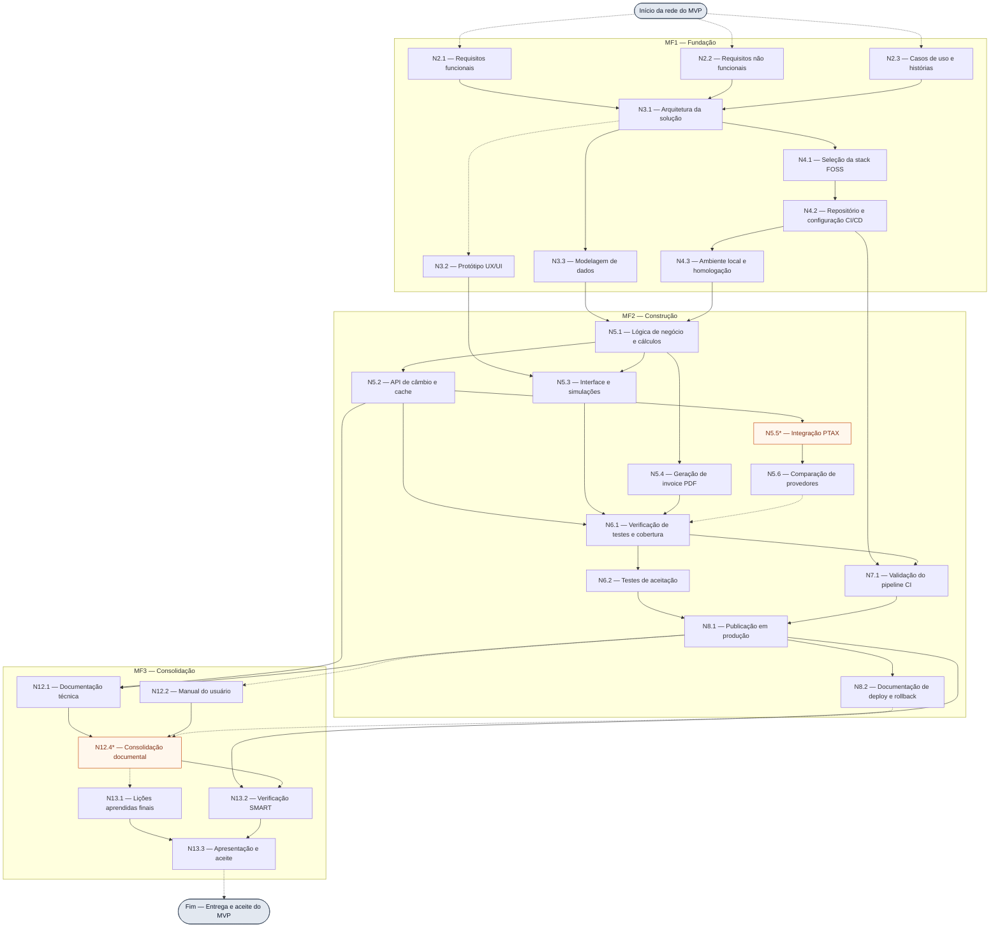

# 2.4.3 Rede de projeto

[Planejamento e índice](../../../PLANEJAMENTO.md) · [Diagrama editável em Mermaid](diagramas/rede_de_projeto_cogme.mmd)

A rede do projeto COGME representa as dependências entre as entregas necessárias à construção e à disponibilização do MVP. Sua leitura permite identificar quais resultados precisam estar disponíveis para liberar o trabalho seguinte e quais ramos podem avançar em paralelo, respeitada a disponibilidade dos dois integrantes. O fluxo conecta requisitos, arquitetura, ambiente, cálculo cambial, cotações, interface, comparação de provedores, invoice, testes, publicação, documentação e aceite.

**Figura — Rede de precedência do MVP COGME**

O diagrama utiliza os pacotes da EAP citados na tabela de precedência da monografia. Trata-se de uma rede de planejamento em nível de entregas; sua decomposição completa em atividades e a estimativa de durações serão necessárias para calcular o cronograma e o caminho crítico. As macro-fases agrupam os nós visualmente e não acrescentam dependências além das setas representadas.

Fonte: elaboração a partir da seção 2.4.4 e do Quadro 10 do Modelo-Projeto-COGME, com complementações propostas para conectar os ramos da rede.

## Legenda e critérios de leitura

- **Seta contínua:** dependência registrada na tabela de precedência da monografia e reproduzida no item 2.4.4.
- **Seta tracejada:** conexão proposta nesta representação, ainda sujeita à validação da equipe.
- **Várias setas chegando ao mesmo nó:** todos os resultados predecessores são necessários para a conclusão da entrega indicada.
- **Nós destacados com asterisco:** identificação ou denominação que precisa ser conciliada entre os documentos.

Para a leitura desta rede preliminar, adota-se a relação término–início, sem defasagem: a entrega predecessora disponibiliza o resultado necessário à sucessora. Essa convenção é uma proposta de modelagem, pois a tabela de origem ainda não explicita tipos de vínculo. Na decomposição em atividades, os vínculos deverão refletir a execução real. Testes, preparação do pipeline, redação de documentação e registro de lições podem começar durante o desenvolvimento; os nós correspondentes representam sua verificação ou consolidação para a entrega.

## Aplicação ao COGME

A definição da arquitetura depende dos requisitos funcionais, não funcionais e dos casos de uso. A arquitetura orienta a modelagem dos dados e a seleção tecnológica; a configuração do ambiente e o modelo de dados, por sua vez, fornecem as condições para implementar a lógica de negócio.

Após a lógica de cálculo, a rede se divide em três ramos: cotações e cache, interface de simulação e geração de invoice em PDF. O ramo de cotações inclui a integração PTAX e o comparativo de provedores. A proposta acrescenta a comparação como predecessora da verificação integrada de testes, evitando que o produto seja encaminhado ao aceite sem verificar essa funcionalidade prevista na monografia.

A publicação depende do aceite funcional e da validação do pipeline, conforme a tabela de origem. A documentação técnica, o manual do usuário, o registro de deploy e as lições aprendidas convergem para a consolidação documental e a apresentação final. Essa representação não afirma que as entregas estejam concluídas nem que o comparativo adicional já tenha sido formalmente aprovado no TAP.

## Complementações propostas à tabela de origem

| Conexão tracejada | Justificativa |
| --- | --- |
| Início → N2.1, N2.2 e N2.3 | Definir o ponto de entrada dos três conjuntos de requisitos; a rede começa após a iniciação e autorização do projeto. |
| N3.1 → N3.2 | Posicionar o protótipo na rede, utilizando a arquitetura e os requisitos que a antecedem como referência. A sequência deve ser validada na decomposição das atividades. |
| N5.6 → N6.1 | Incluir a comparação de provedores na verificação integrada do MVP. |
| N8.1 → N12.2 | Vincular a consolidação do manual à versão publicada; sua redação pode começar anteriormente. |
| N8.2 → N12.4 | Incluir a documentação de deploy e rollback na consolidação documental. |
| N12.4 → N13.1 | Posicionar a consolidação das lições finais antes da apresentação; o registro de lições permanece contínuo. |
| N13.3 → Fim | Representar o marco de término da rede após apresentação e aceite. |

As conexões tracejadas ainda não substituem as dependências da [Tabela de Precedência](02_04_04_tabela_de_precedencia.md). Sua incorporação deverá ocorrer junto com a revisão dessa tabela e da lista de atividades, mantendo os três instrumentos coerentes.

## Limites e pontos a conciliar

O código **N5.5*** identifica exclusivamente a integração PTAX nesta figura. A EAP da monografia utiliza o mesmo código para SDD com IA; por isso, foi usado o identificador técnico `PTAX` no arquivo Mermaid, sem renumerar a EAP ou presumir resolução da duplicidade.

O pacote **N12.4*** aparece na origem como “Consolidação da Documentação Parcial”, alocado na macro-fase final. A figura usa a denominação abreviada “Consolidação documental”, preservando o código. A entrega documental parcial de setembro deverá ter seu marco próprio na revisão do cronograma; não se deve interpretá-la como entrega adiada até o final do projeto.

Planejamento, comunicação, gestão de mudanças, acompanhamento de riscos e revisão do código assistido por IA são atividades de apoio ao longo do projeto. Esta figura delimita o fluxo principal do MVP, sem representar todos os pacotes da EAP. Também não destaca um caminho crítico: faltam durações e análise da capacidade da equipe para essa determinação.

## Próximos incrementos

O diagrama de entregas foi gerado. Permanecem pendentes:

- [ ] Validar as conexões propostas e resolver os códigos e marcos divergentes.
- [ ] Decompor os pacotes em atividades e sincronizar os códigos com os itens 2.4.1 e 2.4.4.
- [ ] Estimar durações, atribuir recursos e calcular datas e folgas no item 2.4.5.

## Fontes documentais

- [Modelo-Projeto-COGME.docx](../../docx/Monografia/Modelo-Projeto-COGME.docx), seções 2.2.2, 2.4.3 e 2.4.4.
- [Termo de Abertura do Projeto v1_opngoing.docx](../../docx/Termo%20de%20Abertura%20do%20Projeto%20v1_opngoing.docx), escopo, EAP, requisitos e restrições.
