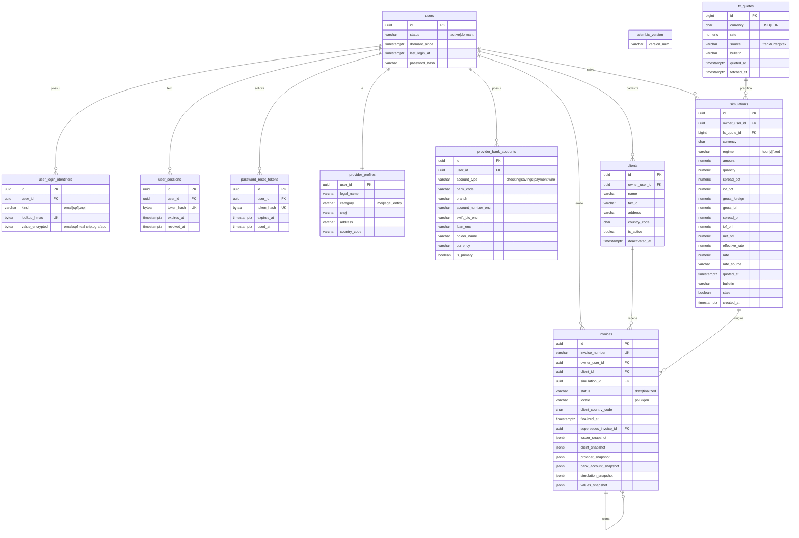

# DER — COGME (Diagrama Entidade-Relacionamento)

> **Status**: Tabela `fx_quotes` implementada; demais tabelas em **specs draft** (PROP-018 a PROP-021), aguardando ratificação CCB.

```mermaid
erDiagram
    %% ============================
    %% TABELAS EXISTENTES (MVP)
    %% ============================
    fx_quotes {
        bigint id PK
        char currency "USD|EUR"
        numeric rate
        varchar source "frankfurter|ptax"
        varchar bulletin
        timestamptz quoted_at
        timestamptz fetched_at
    }

    alembic_version {
        varchar version_num
    }

    %% ============================
    %% SPEC-017: IDENTIDADE/ACESSO (PROP-018)
    %% ============================
    users {
        uuid id PK
        varchar status "active|dormant"
        timestamptz dormant_since
        timestamptz last_login_at
        varchar password_hash
    }

    user_login_identifiers {
        uuid id PK
        uuid user_id FK
        varchar kind "email|cpf|cnpj"
        bytea lookup_hmac UK
        bytea value_encrypted "email/cpf real criptografado"
    }

    user_sessions {
        uuid id PK
        uuid user_id FK
        bytea token_hash UK
        timestamptz expires_at
        timestamptz revoked_at
    }

    password_reset_tokens {
        uuid id PK
        uuid user_id FK
        bytea token_hash UK
        timestamptz expires_at
        timestamptz used_at
    }

    %% ============================
    %% SPEC-018: PRESTADORA/BANCO (PROP-019)
    %% ============================
    provider_profiles {
        uuid user_id PK
        varchar legal_name
        varchar category "mei|legal_entity"
        varchar cnpj
        varchar address
        varchar country_code
    }

    provider_bank_accounts {
        uuid id PK
        uuid user_id FK
        varchar account_type "checking|savings|payment|wire"
        varchar bank_code
        varchar branch
        varchar account_number_enc
        varchar swift_bic_enc
        varchar iban_enc
        varchar holder_name
        varchar currency
        boolean is_primary
    }

    %% ============================
    %% SPEC-019: CLIENTES (PROP-020)
    %% ============================
    clients {
        uuid id PK
        uuid owner_user_id FK
        varchar name
        varchar tax_id
        varchar address
        char country_code
        boolean is_active
        timestamptz deactivated_at
    }

    %% ============================
    %% SPEC-020: SIMULAÇÕES/INVOICES (PROP-021)
    %% ============================
    simulations {
        uuid id PK
        uuid owner_user_id FK
        bigint fx_quote_id FK
        char currency
        varchar regime "hourly|fixed"
        numeric amount
        numeric quantity
        numeric spread_pct
        numeric iof_pct
        numeric gross_foreign
        numeric gross_brl
        numeric spread_brl
        numeric iof_brl
        numeric net_brl
        numeric effective_rate
        numeric rate
        varchar rate_source
        timestamptz quoted_at
        varchar bulletin
        boolean stale
        timestamptz created_at
    }

    invoices {
        uuid id PK
        varchar invoice_number UK
        uuid owner_user_id FK
        uuid client_id FK
        uuid simulation_id FK
        varchar status "draft|finalized"
        varchar locale "pt-BR|en"
        char client_country_code
        timestamptz finalized_at
        uuid supersedes_invoice_id FK
        jsonb issuer_snapshot
        jsonb client_snapshot
        jsonb provider_snapshot
        jsonb bank_account_snapshot
        jsonb simulation_snapshot
        jsonb values_snapshot
    }

    %% ============================
    %% RELACIONAMENTOS
    %% ============================
    users ||--o{ user_login_identifiers : "possui"
    users ||--o{ user_sessions : "tem"
    users ||--o{ password_reset_tokens : "solicita"
    users ||--|| provider_profiles : "é"
    users ||--o{ provider_bank_accounts : "possui"
    users ||--o{ clients : "cadastra"
    users ||--o{ simulations : "salva"
    users ||--o{ invoices : "emite"

    fx_quotes ||--o{ simulations : "precifica"
    clients ||--o{ invoices : "recebe"
    simulations ||--o{ invoices : "origina"
    invoices ||--o{ invoices : "clona"
```
